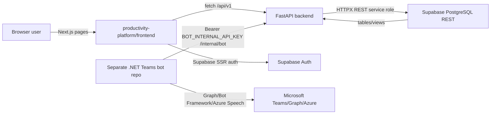
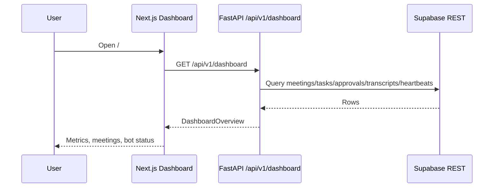
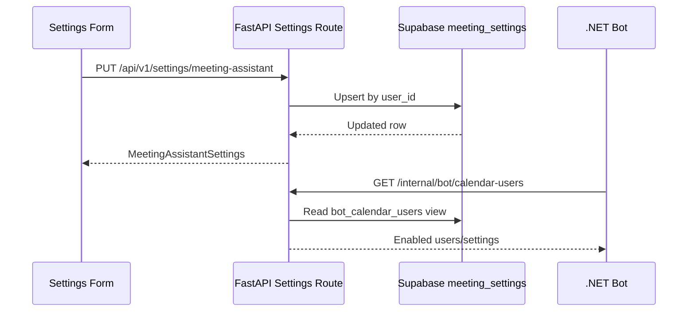
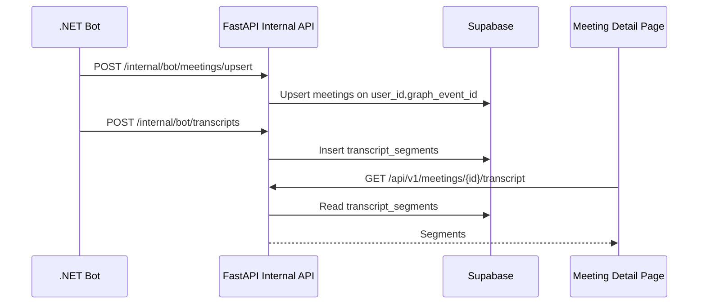

# Codebase Quick Map

Last mapped: 2026-05-18
Status: Evidence-first map created from current workspace source; no CI or first-party tests found.
Owner: Unassigned in repo.
Last verified from files: `Documentation/*.md`, `productivity-platform/README.md`, `productivity-platform/backend/**`, `productivity-platform/frontend/**`, `productivity-platform/docs/**`, `productivity-platform/.env.example`

## What This Project Does

MeetIQ is a productivity platform around a separate ASP.NET Core Teams media bot. This repo contains product documentation plus a FastAPI backend, a Next.js frontend, Supabase schema scripts, and bot-platform integration contracts.

- `productivity-platform/backend`: FastAPI API for dashboard data, meeting settings, meeting records, transcripts, bot health, and internal bot reporting.
- `productivity-platform/frontend`: Next.js app for dashboard, meetings, settings, integrations, auth, and placeholder product surfaces.
- `productivity-platform/backend/supabase`: manual Supabase schema and seed scripts.
- `Documentation`: legacy/planning docs, including the .NET bot overview and product implementation plan. These are useful context, but source code is the runtime authority.
- Separate .NET bot repo: expected to own Teams/Graph media, calendar scanning, Azure Speech, approval cards, and transcript capture. It is not present in this workspace.

## Tech Stack

- Backend: Python `>=3.12`, FastAPI, Uvicorn, Pydantic Settings, HTTPX.
- Frontend: Next.js `^16.0.0`, React `^19.0.0`, TypeScript, Tailwind CSS, lucide-react, Supabase SSR client.
- Storage/auth: Supabase Auth, Supabase PostgreSQL, Supabase REST API via service role key.
- Bot integration: internal FastAPI routes under `/internal/bot/*` protected by `BOT_INTERNAL_API_KEY`.
- External integrations planned or documented: Microsoft 365/Graph, Teams bot, Azure Speech, Azure Blob Storage, OpenAI/Azure OpenAI, SMTP.
- Tests/quality: `pytest` and `ruff` declared for backend dev extras; frontend package declares `next lint`, but no test files or CI files were found.
- Deployment: no Dockerfile, compose file, pipeline, or infrastructure code found.

## Architecture At A Glance

### System Context

| Actor / System | Talks To | Protocol / Mechanism | Purpose |
|---|---|---|---|
| Browser user | Next.js frontend | HTTP pages and client-side Supabase auth | Login, view dashboard/meetings/settings/integrations. |
| Next.js frontend | FastAPI backend | `fetch` to `NEXT_PUBLIC_API_BASE_URL`, default `http://localhost:8000` | Load platform data and save meeting assistant settings. |
| Next.js frontend | Supabase Auth | `@supabase/ssr` browser/server clients | Sign in, sign up, session middleware redirect. |
| FastAPI backend | Supabase REST | HTTPX to `{SUPABASE_URL}/rest/v1/*` with service role key | Read/write platform tables. |
| .NET Teams bot | FastAPI internal API | Bearer token using `BOT_INTERNAL_API_KEY` | Fetch calendar users and report meetings, statuses, transcripts, events, heartbeats, approval decisions. |
| Supabase database | Browser and FastAPI | Auth/RLS for browser; service role for backend | Product data, bot event data, transcript data. |

### Container View



### Deployment / Runtime View

| Environment | Command | Port / URL | Config Source | Dependencies | Mismatches |
|---|---|---|---|---|---|
| Backend dev | `cd productivity-platform/backend; python -m pip install -e ".[dev]"; uvicorn app.main:app --reload --host 0.0.0.0 --port 8000` | `http://localhost:8000` | `productivity-platform/.env` loaded by `app/core/config.py` | Python 3.12, Supabase project, service role key | README says these checks exist, but endpoints that hit Supabase require config and may return empty fallback data. |
| Frontend dev | `cd productivity-platform/frontend; npm install; npm run dev` | `http://localhost:3000` | `productivity-platform/frontend/.env.local` and public env vars | Node/npm, backend on `8000`, Supabase public auth vars | `npm run lint` maps to `next lint`; Next 16 may require validating this command locally. |
| Supabase setup | Manual SQL in Supabase SQL editor | Supabase hosted project | `backend/supabase/*.sql` | Supabase Auth user must already exist for seed | Seed script contains a fixed test UUID and placeholder email. |
| .NET bot | Not runnable from this repo | External bot host | Separate .NET bot repo config plus same `BOT_INTERNAL_API_KEY` | Teams/Graph/Azure Speech/Bot Framework | This repo has docs/contracts only; no .NET bot source here. |

### Active vs Legacy Runtime Boundary

| Surface | Status | Evidence | Notes |
|---|---|---|---|
| FastAPI `/health`, `/api/v1/*`, `/internal/bot/*` | Active runtime | `backend/app/main.py`, routers under `backend/app/api` and `backend/app/internal` | Current backend app. |
| Next.js dashboard, meetings, settings, integrations, login | Active runtime | `frontend/app/**`, `frontend/lib/api.ts`, `frontend/proxy.ts` | Several pages catch backend failures and show fallback/empty states. |
| Analytics, approvals, AI chat, tasks, channels | Placeholder/manual-only | Static pages and TODO routes | Product surfaces exist but most are not wired to backend data. |
| Azure Speech, Azure Blob, Microsoft Graph, OpenAI env keys in this repo | Planned/duplicated config | `.env.example`, docs | Backend config currently does not read these keys. The .NET bot should own most Microsoft/Azure bot secrets until platform code needs them. |
| `Documentation/CODEBASE_OVERVIEW.md` .NET bot details | External repo documentation | Documentation only | Useful to understand bot behavior, but not executable in this workspace. |

## Prerequisites And Access

| Requirement | Local Decision | Repo Evidence | Verification Command |
|---|---|---|---|
| Python 3.12+ | Required for backend | `backend/pyproject.toml` `requires-python = ">=3.12"` | `python --version` |
| Node/npm | Required for frontend | `frontend/package.json`, `package-lock.json` | `node --version; npm --version` |
| Supabase project | Required for live data | `.env.example`, `backend/supabase/001_initial_schema.sql` | `Invoke-RestMethod http://localhost:8000/api/v1/health` plus Supabase-backed API checks |
| Supabase Auth user | Required for login and seeded profile | `002_seed_test_user.sql` says Auth user must exist | Create user in Supabase dashboard before running seed |
| `BOT_INTERNAL_API_KEY` | Required for internal bot API | `backend/app/internal/security.py` | Call `/internal/bot/calendar-users` with `Authorization: Bearer <key>` |
| Separate .NET bot repo | Required for Teams meeting ingestion | `Documentation/IMPLEMENTATION_PLAN.md`, `docs/contracts/bot-platform-api.md` | Verify bot can call FastAPI internal routes |

## How To Run

1. Prepare platform env files.

```powershell
cd E:\Productivity_Tool_V1\productivity-platform
Copy-Item .env.example .env
Copy-Item .env.example frontend\.env.local
```

2. Fill only needed local keys first.

```env
APP_ENV=development
APP_NAME=MeetIQ
API_BASE_URL=http://localhost:8000
FRONTEND_BASE_URL=http://localhost:3000
CORS_ALLOWED_ORIGINS=http://localhost:3000
SUPABASE_URL=
SUPABASE_ANON_KEY=
SUPABASE_SERVICE_ROLE_KEY=
SUPABASE_JWT_SECRET=
DATABASE_URL=
BOT_INTERNAL_API_KEY=
DEV_USER_ID=
NEXT_PUBLIC_API_BASE_URL=http://localhost:8000
NEXT_PUBLIC_SUPABASE_URL=
NEXT_PUBLIC_SUPABASE_ANON_KEY=
```

3. Create Supabase schema manually.

```text
Open Supabase SQL Editor and run:
productivity-platform/backend/supabase/001_initial_schema.sql
```

4. Seed a local test user after creating the matching Supabase Auth user.

```text
Open Supabase SQL Editor and run:
productivity-platform/backend/supabase/002_seed_test_user.sql
```

5. Run backend.

```powershell
cd E:\Productivity_Tool_V1\productivity-platform\backend
python -m venv .venv
.\.venv\Scripts\Activate.ps1
python -m pip install -e ".[dev]"
uvicorn app.main:app --reload --host 0.0.0.0 --port 8000
```

6. Run frontend.

```powershell
cd E:\Productivity_Tool_V1\productivity-platform\frontend
npm install
npm run dev
```

7. Smoke-check URLs.

```powershell
Invoke-RestMethod http://localhost:8000/health
Invoke-RestMethod http://localhost:8000/api/v1/health
Invoke-RestMethod http://localhost:8000/api/v1/dashboard
```

8. Smoke-check internal bot route with a real key.

```powershell
$headers = @{ Authorization = "Bearer $env:BOT_INTERNAL_API_KEY" }
Invoke-RestMethod http://localhost:8000/internal/bot/calendar-users -Headers $headers
```

## Required Services And Config

| Service / Config | Keys | Used By Current Code | Operational Notes |
|---|---|---|---|
| FastAPI runtime | `APP_ENV`, `APP_NAME`, `API_BASE_URL`, `FRONTEND_BASE_URL`, `CORS_ALLOWED_ORIGINS` | `backend/app/core/config.py`, `backend/app/main.py` | `APP_ENV=production` disables OpenAPI docs. |
| Backend security | `BACKEND_SECRET_KEY`, `BOT_INTERNAL_API_KEY`, `ENABLE_BOT_INTERNAL_APIS` | `BOT_INTERNAL_API_KEY` and `ENABLE_BOT_INTERNAL_APIS` used by `internal/security.py`; `BACKEND_SECRET_KEY` loaded but not currently used | Do not commit real values. |
| Supabase backend | `SUPABASE_URL`, `SUPABASE_SERVICE_ROLE_KEY` | `backend/app/db/supabase.py` | Missing config raises 503 on direct gateway calls; many public services swallow errors and return empty data. |
| Supabase browser auth | `NEXT_PUBLIC_SUPABASE_URL`, `NEXT_PUBLIC_SUPABASE_ANON_KEY` | `frontend/lib/supabase/client.ts`, `frontend/proxy.ts` | Public anon key is expected in browser; service role key must never be public. |
| Local user fallback | `DEV_USER_ID` | `services/meeting_settings.py`, dashboard and meetings services | Auth-backed user resolution is not implemented in backend yet. |
| Microsoft/Azure/OpenAI/SMTP | `MICROSOFT_*`, `TEAMS_BOT_*`, `AZURE_*`, `OPENAI_*`, `SMTP_*` | Not read by current backend config | Keep out of real platform env unless implementing platform-side use. Most bot secrets belong in .NET bot repo. |

Preflight checks:

- Confirm `.env` is ignored by `productivity-platform/.gitignore`.
- Confirm `frontend/.env.local` contains only `NEXT_PUBLIC_*` values needed by browser code.
- Confirm `SUPABASE_SERVICE_ROLE_KEY` appears only in backend server config, never frontend.
- Confirm `BOT_INTERNAL_API_KEY` matches the separate .NET bot repo.

## Important Folders

| Path | Role | Change Risk |
|---|---|---|
| `productivity-platform/backend/app/main.py` | FastAPI app factory, CORS, health route, router registration | Medium; affects all backend runtime. |
| `productivity-platform/backend/app/api/v1/routes` | Public API routes consumed by frontend | Medium; changing response shape can break pages. |
| `productivity-platform/backend/app/internal/routes` | Internal bot API routes | High; contract with separate .NET bot. |
| `productivity-platform/backend/app/services` | Business/data access services | Medium/high; many routes depend on Supabase query shapes. |
| `productivity-platform/backend/app/db/supabase.py` | Supabase REST gateway | High; central service role usage and error behavior. |
| `productivity-platform/backend/supabase` | Manual schema and seed SQL | High; changes need migration/backfill plan. |
| `productivity-platform/frontend/app` | Next.js route pages | Medium; user-visible surfaces. |
| `productivity-platform/frontend/lib/api.ts` | Frontend API client and shared response types | High; central frontend/backend contract. |
| `productivity-platform/frontend/proxy.ts` | Supabase SSR auth middleware | High; affects route access. |
| `Documentation` | Product and .NET bot docs | Low runtime risk; high planning/reference value. |

## Key Entry Points

| Entry | Path | Purpose |
|---|---|---|
| Backend app | `productivity-platform/backend/app/main.py` | Creates FastAPI app, CORS middleware, `/health`, router include. |
| API root router | `productivity-platform/backend/app/api/router.py` | Mounts `/api/v1` and `/internal`. |
| Public API router | `productivity-platform/backend/app/api/v1/router.py` | Registers health, dashboard, settings, meetings, tasks, analytics, integrations. |
| Internal bot router | `productivity-platform/backend/app/internal/router.py` | Mounts `/internal/bot`. |
| Frontend root layout | `productivity-platform/frontend/app/layout.tsx` | Fonts, metadata, global CSS. |
| Frontend auth proxy | `productivity-platform/frontend/proxy.ts` | Redirects unauthenticated users to `/login`. |
| Frontend API client | `productivity-platform/frontend/lib/api.ts` | All current frontend `fetch` calls to FastAPI. |
| Supabase schema | `productivity-platform/backend/supabase/001_initial_schema.sql` | Tables, indexes, view, RLS policies. |

## Core Concepts / Glossary

- Meeting assistant: platform settings that tell the .NET bot whether and how to scan calendars, request approval, and join meetings.
- Bot internal API: FastAPI endpoints under `/internal/bot` that the separate .NET bot calls with `BOT_INTERNAL_API_KEY`.
- Calendar user: a row returned by `bot_calendar_users` view, joining `calendar_connections` and `meeting_settings`.
- Transcript segment: one finalized transcript line posted by the bot to `transcript_segments`.
- Bot heartbeat: latest check-in by a bot instance in `bot_heartbeats`.
- Bot event: operational event from the bot stored in `bot_events`.
- Dev user: backend currently scopes user-facing queries via `DEV_USER_ID`; backend JWT user resolution is not implemented.

| Table / View | Writers | Readers | Lifecycle / Status |
|---|---|---|---|
| `profiles` | Supabase Auth seed/manual setup | RLS policies, joins | Auth-backed user profile. |
| `calendar_connections` | Seed/manual future UI | `bot_calendar_users` view | Enabled Microsoft calendar connection. |
| `meeting_settings` | `/api/v1/settings/meeting-assistant`, seed | `bot_calendar_users`, settings UI | Controls auto-join, approvals, scan windows. |
| `meetings` | `/internal/bot/meetings/upsert`, `/internal/bot/meetings/{id}/status` | dashboard, meetings pages, transcript joins | `status`, `bot_status`, `approval_status` track bot lifecycle. |
| `meeting_approvals` | Planned bot/platform approval flow; internal decision route updates | dashboard counts, approvals placeholder | `pending`, approved/rejected decisions expected. |
| `transcript_segments` | `/internal/bot/transcripts` | meeting detail and dashboard count | Insert-only transcript lines. |
| `meeting_summaries` | Planned AI summary generator | meeting detail summary | JSON `key_points` and `decisions`. |
| `tasks` | Planned task extractor/manual UI | dashboard, meeting detail, tasks placeholder | `todo`/non-`done` status conventions currently mixed. |
| `ai_chat_messages` | Planned AI chat | AI chat placeholder | RAG pending. |
| `bot_events` | `/internal/bot/events` | integrations page | Append-only operational log. |
| `bot_heartbeats` | `/internal/bot/heartbeats` | dashboard and integrations | Upsert by `bot_instance_id`; online if age <= 180 seconds, stale <= 900 seconds in integrations. |
| `bot_calendar_users` | SQL view | `/internal/bot/calendar-users` | Only enabled Microsoft users with `auto_join_enabled = true`. |

## Important Backend Files

| Route | File | Service | Storage / External | Frontend Consumer |
|---|---|---|---|---|
| `GET /health` | `backend/app/main.py` | inline | none | smoke checks |
| `GET /api/v1/health` | `api/v1/routes/health.py` | inline | none | smoke checks |
| `GET /api/v1/dashboard` | `api/v1/routes/dashboard.py` | `services/dashboard.py` | Supabase: `meetings`, `tasks`, `meeting_approvals`, `transcript_segments`, `bot_heartbeats` | `frontend/app/page.tsx` |
| `GET /api/v1/meetings` | `api/v1/routes/meetings.py` | `services/meetings.py` | Supabase: `meetings` | `frontend/app/meetings/page.tsx` |
| `GET /api/v1/meetings/{id}` | `api/v1/routes/meetings.py` | `services/meetings.py` | Supabase: `meetings` | `frontend/app/meetings/[id]/page.tsx` |
| `GET /api/v1/meetings/{id}/transcript` | `api/v1/routes/meetings.py` | `services/meetings.py` | Supabase: `transcript_segments` | meeting detail |
| `GET /api/v1/meetings/{id}/summary` | `api/v1/routes/meetings.py` | `services/meetings.py` | Supabase: `meeting_summaries` | meeting detail |
| `GET /api/v1/meetings/{id}/tasks` | `api/v1/routes/meetings.py` | `services/meetings.py` | Supabase: `tasks` | meeting detail |
| `GET /api/v1/settings/meeting-assistant` | `api/v1/routes/settings.py` | `services/meeting_settings.py` | Supabase: `meeting_settings` | settings page |
| `PUT /api/v1/settings/meeting-assistant` | `api/v1/routes/settings.py` | `services/meeting_settings.py` | Supabase upsert: `meeting_settings` | settings form |
| `GET/PUT /api/v1/settings/transcription` | `api/v1/routes/settings.py` | inline TODO | none | transcription page is static, not API-backed |
| `GET /api/v1/integrations/bot-health` | `api/v1/routes/integrations.py` | `services/integrations.py` | Supabase: `bot_heartbeats`, `bot_events` | integrations page |
| `GET /api/v1/integrations/bot-events` | `api/v1/routes/integrations.py` | `services/integrations.py` | Supabase: `bot_events` | integrations page |
| `GET /api/v1/analytics/overview` | `api/v1/routes/analytics.py` | inline TODO | none | no current frontend consumer found |
| `GET /api/v1/tasks` | `api/v1/routes/tasks.py` | inline TODO | none | no current frontend consumer found |
| `GET /internal/bot/calendar-users` | `internal/routes/bot.py` | `services/bot_calendar_users.py` | Supabase view: `bot_calendar_users` | separate .NET bot |
| `POST /internal/bot/heartbeats` | `internal/routes/bot.py` | `services/bot_events.py` | Supabase upsert: `bot_heartbeats` | separate .NET bot |
| `POST /internal/bot/events` | `internal/routes/bot.py` | `services/bot_events.py` | Supabase insert: `bot_events` | separate .NET bot |
| `POST /internal/bot/meetings/upsert` | `internal/routes/bot.py` | `services/bot_reporting.py` | Supabase upsert: `meetings` | separate .NET bot |
| `POST /internal/bot/meetings/{meeting_id}/status` | `internal/routes/bot.py` | `services/bot_reporting.py` | Supabase patch: `meetings` | separate .NET bot |
| `POST /internal/bot/transcripts` | `internal/routes/bot.py` | `services/bot_reporting.py` | Supabase insert: `transcript_segments` | separate .NET bot |
| `POST /internal/bot/approvals/{approval_id}/decision` | `internal/routes/bot.py` | `services/bot_reporting.py` | Supabase patch: `meeting_approvals`, then `meetings` | separate .NET bot |

## Important Frontend Files

| Surface | Key Files | API Consumers | Behavior / Defaults |
|---|---|---|---|
| Auth | `app/login/page.tsx`, `components/auth-form.tsx`, `lib/supabase/client.ts`, `proxy.ts` | Supabase Auth only | `/login` public; all other paths redirect to `/login` if no Supabase user and env is configured. |
| Shell/navigation | `components/app-shell.tsx`, `components/ui.tsx` | none | Hardcoded user display `Test User`; active nav state is static. |
| Dashboard | `app/page.tsx`, `lib/api.ts` | `GET /api/v1/dashboard` | Falls back to API offline metrics if backend fails. |
| Meetings list | `app/meetings/page.tsx` | `GET /api/v1/meetings` | Splits upcoming/recent in server component by `Date.now()`. |
| Meeting detail | `app/meetings/[id]/page.tsx` | meeting, transcript, summary, tasks routes | Calls `notFound()` if meeting cannot load; dependent data falls back empty. |
| Meeting assistant settings | `app/settings/meeting-assistant/page.tsx`, `components/meeting-assistant-settings-form.tsx` | `GET/PUT /api/v1/settings/meeting-assistant` | Uses fallback settings if API fails; client form saves via fetch. |
| Integrations | `app/integrations/page.tsx` | `GET /api/v1/integrations/bot-health`, `GET /api/v1/integrations/bot-events` | Shows fallback unknown/no-data states if API fails. |
| Static placeholders | `app/analytics`, `app/approvals`, `app/ai-chat`, `app/tasks`, `app/channels`, `app/settings/transcription` | none or not wired | Product UI scaffolds only; no live writes. |
| API client | `frontend/lib/api.ts` | all FastAPI public calls | Defaults `NEXT_PUBLIC_API_BASE_URL` to `http://localhost:8000`; no auth token forwarding to FastAPI. |

WebSocket/polling behavior: no `WebSocket`, `EventSource`, or `setInterval` usage found. Current pages rely on server rendering and manual navigation/refresh.

## Important Docs

| Path | Read When | Trust Level |
|---|---|---|
| `productivity-platform/README.md` | First-run platform setup | Medium; commands match manifests, but validate locally. |
| `productivity-platform/docs/supabase-setup.md` | Creating Supabase project/tables | Medium; includes one malformed SQL snippet in prose, but actual seed SQL file is valid. |
| `productivity-platform/docs/contracts/bot-platform-api.md` | Implementing .NET bot calls into FastAPI | High for intended contract; still verify with `internal/routes/bot.py`. |
| `Documentation/IMPLEMENTATION_PLAN.md` | Product roadmap and boundaries | Planning doc; not all features implemented. |
| `Documentation/CODEBASE_OVERVIEW.md` | Separate .NET bot behavior | External repo doc; useful but not runnable here. |
| `Documentation/PRD_Productivity_Platform_v2.md` | Product vision | Product requirements; many features are future work. |

ADR index: no `docs/adr`, `adr`, or architecture decision records found. Backlog: add ADRs for platform/bot boundary, Supabase REST vs SQLAlchemy, auth model, and secret ownership.

## Important Flows

1. Dashboard load
   - `frontend/app/page.tsx` calls `getDashboard()`.
   - `frontend/lib/api.ts` fetches `/api/v1/dashboard`.
   - `backend/app/api/v1/routes/dashboard.py` calls `services/dashboard.py`.
   - Service queries Supabase tables using `DEV_USER_ID`.
   - UI renders metrics or API-offline fallback.



2. Meeting assistant settings update
   - Settings page loads current row from `meeting_settings`.
   - Client form calls `PUT /api/v1/settings/meeting-assistant`.
   - Backend upserts `meeting_settings` for `DEV_USER_ID`.
   - Bot later sees enabled users through `bot_calendar_users`.



3. Bot reports a meeting and transcript
   - .NET bot calls internal routes with `Authorization: Bearer <BOT_INTERNAL_API_KEY>`.
   - FastAPI validates key in `internal/security.py`.
   - Meeting is upserted by `(user_id, graph_event_id)`.
   - Transcript segments are inserted for the meeting.
   - Frontend meeting detail reads meeting/transcript data.



| Flow | Primary Owner | Files | Risk |
|---|---|---|---|
| Auth/session redirect | Frontend | `proxy.ts`, `auth-form.tsx`, `lib/supabase/client.ts` | Missing env disables redirect enforcement in proxy. |
| User data scoping | Backend | `services/meeting_settings.py`, `services/dashboard.py`, `services/meetings.py` | Uses `DEV_USER_ID`, not authenticated backend user. |
| Bot ingestion | Backend + .NET bot | `internal/routes/bot.py`, `services/bot_reporting.py`, contract docs | Contract drift breaks production ingestion. |
| Schema changes | Backend + Supabase | `backend/supabase/*.sql`, service query strings | Manual SQL only; no migration runner. |

## Common Change Recipes

Standard checklist:

1. State goal and user-visible outcome.
2. Identify route/page/service/table files from this map.
3. Update schema first if data shape changes.
4. Update backend schemas/services/routes.
5. Update frontend API types and consuming pages.
6. Add or update tests; if no test framework exists for the slice, add a focused smoke script or manual verification.
7. Update docs/contracts if route payloads, env keys, or bot behavior changes.
8. Add logging/observability if the flow touches bot ingestion or external services.
9. Define rollback: previous SQL, previous env, previous route payload, or feature flag.
10. Run smoke checks.

| Change | Preconditions | Files | Tests / Smoke | Rollback |
|---|---|---|---|---|
| Add public API route | Backend env works; route path chosen | `api/v1/routes/*.py`, `api/v1/router.py`, service module, `frontend/lib/api.ts` | `Invoke-RestMethod`, add pytest when available | Remove router include and frontend call. |
| Add frontend page | Backend endpoint stable or fallback designed | `frontend/app/<route>/page.tsx`, `components`, `lib/api.ts` | `npm run build`; browser check | Revert page and nav link. |
| Change bot contract | Coordinate .NET bot | `internal/schemas.py`, `internal/routes/bot.py`, `docs/contracts/bot-platform-api.md` | Call route with sample JSON and bearer key | Keep backward-compatible fields or support old payload. |
| Change Supabase table | Migration/backfill plan | `backend/supabase/*.sql`, services query strings, frontend types | Run SQL in staging; query affected endpoints | SQL rollback or restore backup. |
| Add secret/config key | Decide owner and runtime | `.env.example`, `core/config.py`, README/docs | Start app with missing and present key | Remove config field and dependent code. |
| Add AI summary flow | OpenAI/Azure OpenAI decision made | New service, `meeting_summaries`, feature flags | Unit tests with mocked provider | Disable `ENABLE_AI_SUMMARIES`; keep raw transcripts. |
| Add realtime/polling | Data freshness requirement clear | frontend page/client component, backend route | Browser timing check; load test if polling | Remove interval/realtime subscription. |
| Update docs only | Source behavior verified | `docs/codebase-map.md`, `Documentation` or `productivity-platform/docs` | Link/path check | Revert doc commit. |

## Env Vars And Config Keys

| Key | Current Code Use | Secret? | Notes |
|---|---|---|---|
| `APP_ENV` | Backend docs/OpenAPI toggle | No | `production` disables docs/redoc/openapi. |
| `APP_NAME` | Backend app title/health | No | Defaults to `MeetIQ`. |
| `API_BASE_URL` | Loaded in backend config | No | Not currently used outside config. |
| `FRONTEND_BASE_URL` | Loaded in backend config | No | Not currently used outside config. |
| `CORS_ALLOWED_ORIGINS` | FastAPI CORS | No | Comma-separated. |
| `BACKEND_SECRET_KEY` | Loaded only | Yes | No current runtime use found. |
| `BOT_INTERNAL_API_KEY` | Internal bot route auth | Yes | Must match .NET bot. |
| `DEV_USER_ID` | Backend user scoping | Sensitive-ish | Temporary fallback until backend auth is implemented. |
| `SUPABASE_URL` | Backend Supabase REST | No | Needed for live data. |
| `SUPABASE_ANON_KEY` | Loaded backend; public frontend equivalent used | Public-ish | Browser anon key belongs in `NEXT_PUBLIC_SUPABASE_ANON_KEY`. |
| `SUPABASE_SERVICE_ROLE_KEY` | Backend Supabase REST | Yes | Server-only. Never expose to frontend. |
| `SUPABASE_JWT_SECRET` | Loaded only | Yes | Backend JWT verification not implemented yet. |
| `DATABASE_URL` | Loaded only | Yes | No SQLAlchemy/direct DB use currently. |
| `NEXT_PUBLIC_API_BASE_URL` | Frontend FastAPI base URL | No | Defaults to `http://localhost:8000`. |
| `NEXT_PUBLIC_SUPABASE_URL` | Frontend Supabase auth | No | Required by browser client. |
| `NEXT_PUBLIC_SUPABASE_ANON_KEY` | Frontend Supabase auth | Public key | Expected client-side. |
| `MICROSOFT_*` | Not used by current code | Yes where secret | Likely belongs in .NET bot or future platform integration. |
| `TEAMS_BOT_*` | Not used by current code | Mixed | Docs/planned integration only. |
| `AZURE_SPEECH_*` | Not used by current code | Key is secret | .NET bot currently owns speech runtime per docs. |
| `AZURE_STORAGE_CONNECTION_STRING` | Not used by current code | Yes | .NET bot/archive path per docs. |
| `SMTP_*` | Not used by current code | Password secret | Email approval not implemented in platform code. |
| `OPENAI_*`, `AZURE_OPENAI_*` | Not used by current code | Keys secret | AI features are placeholders/feature flags. |
| `ENABLE_AI_SUMMARIES`, `ENABLE_AI_CHAT` | Loaded only | No | No active AI implementation found. |
| `ENABLE_BOT_INTERNAL_APIS` | Internal route gate | No | `false` returns 404 for internal bot API. |

## Testing

Current state:

- No first-party test files found.
- Backend declares `pytest` and `ruff` in optional dev dependencies.
- Frontend declares `npm run build` and `npm run lint`; no test script found.
- No CI configuration found.

Test matrix to add:

| Layer | Current Gate | Needed Gate |
|---|---|---|
| Backend routes | Manual `Invoke-RestMethod` | Pytest with FastAPI `TestClient` and mocked Supabase gateway. |
| Internal bot auth | Manual bearer-key check | Tests for missing key, wrong key, disabled API, valid key. |
| Supabase gateway | Manual live Supabase | Unit tests mocking HTTPX responses and error shapes. |
| Frontend build | `npm run build` | Keep build plus component/page smoke tests. |
| Bot contract | Manual JSON calls | Contract fixtures shared with .NET bot. |

First-run verification checklist:

1. `python --version` returns `3.12` or newer.
2. `python -m pip install -e ".[dev]"` succeeds in `backend`.
3. `uvicorn app.main:app --reload --host 0.0.0.0 --port 8000` starts.
4. `Invoke-RestMethod http://localhost:8000/health` returns status `ok`.
5. Supabase SQL scripts have run.
6. `DEV_USER_ID` matches a seeded `profiles.id`.
7. `npm install` succeeds in `frontend`.
8. `npm run build` succeeds.
9. Browser login works with Supabase Auth.
10. `/integrations` shows bot heartbeat after .NET bot posts one.

Quality gates to add:

```powershell
cd E:\Productivity_Tool_V1\productivity-platform\backend
ruff check .
pytest

cd E:\Productivity_Tool_V1\productivity-platform\frontend
npm run build
npm run lint
```

## Debugging Runbooks

| Symptom | Trigger | Command / API Check | Healthy Output | Likely Causes | Next Branch | Escalation |
|---|---|---|---|---|---|---|
| Frontend redirects to `/login` forever | Missing/invalid Supabase session | Check browser cookies and `frontend/proxy.ts` env | Logged-in user reaches `/` | Wrong Supabase URL/anon key, email not confirmed, cookie issue | Test `AuthForm` sign-in result | Supabase auth logs |
| Dashboard shows API offline | Backend fetch failed | `Invoke-RestMethod http://localhost:8000/api/v1/dashboard` | JSON metrics | Backend down, CORS, `NEXT_PUBLIC_API_BASE_URL` wrong | Check backend logs | Platform backend owner |
| Dashboard returns empty data | Supabase query swallowed by `_get_rows` | Check backend logs; query Supabase tables directly | Rows for `DEV_USER_ID` | Missing `DEV_USER_ID`, seed not run, service role invalid | Call `/api/v1/settings/meeting-assistant` | Supabase admin |
| `/internal/bot/calendar-users` returns 401 | Bot key mismatch | Call with `Authorization: Bearer <key>` | List of users | Wrong or missing `BOT_INTERNAL_API_KEY` | Compare platform and .NET bot env key names/values | Bot owner |
| `/internal/bot/calendar-users` returns empty list | No enabled users | Query `bot_calendar_users` view | At least one user | `auto_join_enabled=false`, no calendar connection, seed missing | Check `meeting_settings` and `calendar_connections` | Supabase admin |
| Bot health is offline | No recent heartbeat | `Invoke-RestMethod http://localhost:8000/api/v1/integrations/bot-health` | `bot.status=online` | .NET bot not running, key mismatch, internal API disabled | Check `/internal/bot/heartbeats` with sample payload | Bot owner |
| Meeting detail 404 | Missing meeting row or user mismatch | Query `/api/v1/meetings` and Supabase `meetings` | Meeting row returned | `DEV_USER_ID` mismatch, bot wrote different user id | Compare bot payload user id with seed | Backend/bot owners |
| Settings save fails | PUT route failed | Browser network tab; backend logs | Updated settings JSON | Backend down, Supabase service role missing, `DEV_USER_ID` missing | Call route with `Invoke-RestMethod` | Backend owner |

## Logging And Observability

- No structured logging configuration found.
- FastAPI relies on Uvicorn/default logs.
- Bot operational visibility is stored in Supabase `bot_events` and `bot_heartbeats`.
- Integrations page reads latest bot event and heartbeat, but does not currently show backend exceptions.
- Supabase gateway error details can include upstream response text in HTTP exceptions; avoid returning sensitive provider errors to browser-facing routes in production.
- Backlog: add request IDs, structured logs, redaction rules, error telemetry, and bot contract event severity conventions.

## Risk Register

| Risk | Severity | Impact | Detection | Prevention | Rollback | Owner / Status |
|---|---|---|---|---|---|---|
| Real secrets in local `.env` | High | Credential exposure | Search for committed env files; inspect `.gitignore` | Keep `.env` ignored; rotate any exposed secrets | Rotate keys and purge history if committed | Unassigned; `.gitignore` exists |
| Backend user scoping via `DEV_USER_ID` | High | Users can see wrong data once multi-user is real | Review service filters | Implement backend JWT auth/user resolution | Disable multi-user access until fixed | Unassigned; active gap |
| Supabase service role used directly by all backend data services | High | Backend bug bypasses RLS | Audit gateway calls | Add repository/service authorization checks | Revoke service key, deploy patched backend | Unassigned |
| Public routes swallow Supabase errors and return empty data | Medium | False healthy UI, hard debugging | Backend logs, compare direct Supabase queries | Log exceptions and expose safe degraded status | Restore previous service behavior | Unassigned |
| Manual SQL without migrations | Medium | Schema drift and hard rollback | Compare DB schema to SQL file | Add migration tool and environment promotion | Restore Supabase backup | Unassigned |
| Bot/platform contract drift | High | Meetings/transcripts stop syncing | Internal route 4xx/5xx, bot events missing | Version contract docs and payload tests | Support previous payload shape | Backend + .NET bot |
| Placeholder env keys duplicate .NET bot secrets | Medium | Confusion and secret sprawl | Compare config code to `.env.example` | Keep unused keys empty or remove until implemented | Remove from platform env and rotate if copied | Unassigned |
| No CI/tests | High | Regressions reach runtime | Missing workflow/test files | Add backend and frontend gates | Manual rollback | Unassigned |
| Auth middleware bypass when Supabase public env missing | Medium | Protected pages may render without session | Remove env and open `/` locally | Fail closed outside development | Restore env or change proxy behavior | Frontend owner |
| Static nav active state | Low | UX confusion | Navigate pages | Use pathname-aware nav | Revert nav change | Frontend owner |
| Encoding artifacts in UI text | Low | Poor polish | Look for `·` in rendered pages/source | Replace with ASCII or correct UTF-8 | Revert text edits | Frontend owner |

## Contributing / Help

- No contribution guide, CODEOWNERS, issue templates, or ADRs found.
- Use this map as the first-run source until formal docs exist.
- For platform changes, update source, smoke checks, and this file when runtime boundaries change.
- For .NET bot changes, update `productivity-platform/docs/contracts/bot-platform-api.md` and coordinate the separate bot repo.
- Do not paste real secret values into docs, tickets, commits, or chat.

## Where New Changes Usually Go

| Goal | Start Here | Then Update |
|---|---|---|
| New backend public endpoint | `backend/app/api/v1/routes` | service module, `api/v1/router.py`, `frontend/lib/api.ts`, docs |
| New internal bot endpoint | `backend/app/internal/routes/bot.py` | `internal/schemas.py`, service module, bot contract doc, .NET bot |
| New Supabase data shape | `backend/supabase` | services query strings, frontend types, seed data, docs |
| New frontend screen | `frontend/app` | `components/app-shell.tsx` nav, `lib/api.ts`, backend route if live data needed |
| Auth/user scoping | `frontend/proxy.ts`, `backend/app/services/meeting_settings.py` | backend auth dependency, Supabase JWT validation, service filters |
| Bot health/debugging | `services/integrations.py`, `services/bot_events.py` | integrations page, bot events contract |
| AI summaries/chat | `meeting_summaries`, `ai_chat_messages` tables | new backend services, frontend pages, provider config, tests |

## Suggested Skills For Future Work

- `codebase-quick-map`: refresh this map after meaningful backend/frontend/schema changes.
- `openai-docs`: use before implementing OpenAI or Azure OpenAI integration details.
- `browser-use:browser`: use to inspect local `http://localhost:3000` after frontend changes.
- `skill-creator`: use if this repo needs a project-specific workflow skill for bot/platform contract updates.
